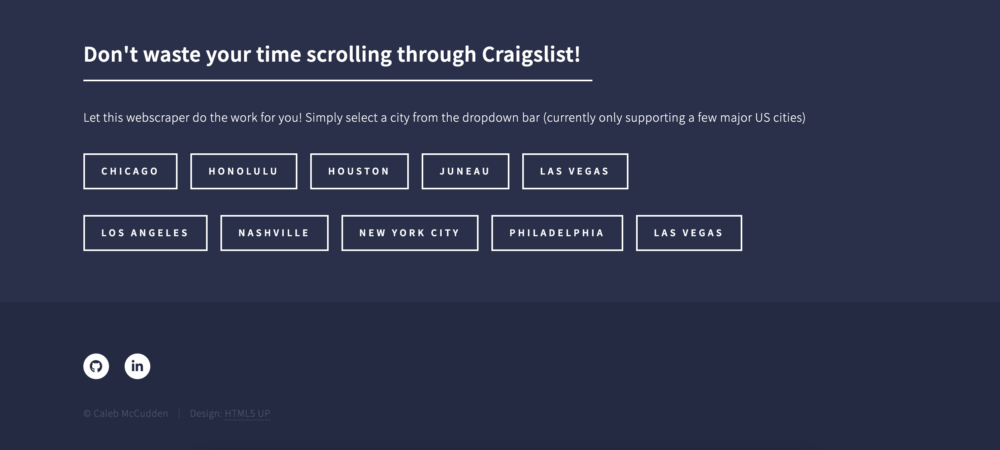
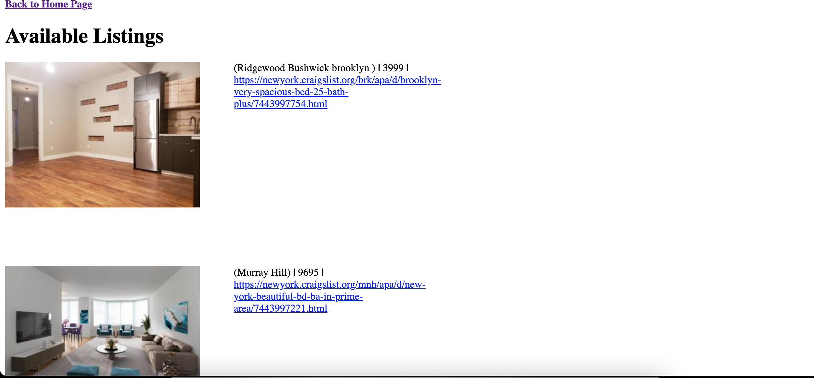

Looking for a new apartment? Let this scraper do the work for you! Using selenium to scrape craigslist listings in select
cities, then saving the address, price, URL link and first photo to a local postgres database and then displaying it on a webpage 
powered by Flask. 

This is a work in progress for me to make it a bit better, I intend to get it up and running live and to scrape through craigslist 
daily to keep the listings you see current. 

